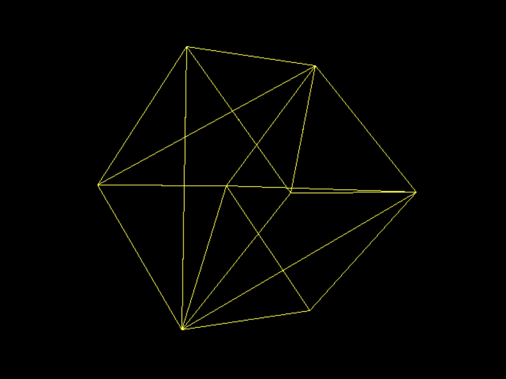

# Day2：线框立方体 — 三角面索引 + Bresenham 画线

本文档对应目录：`record/day2/`（Day2 快照）。  
在 Day1（8 个顶点投影）基础上，新增 **三角面 `Face`**、**12 个三角面拼立方体**、**Bresenham 直线算法** 画线框。

## 效果预览



与 Day1 对比：

| 项目 | Day1 | Day2 |
|------|------|------|
| 绘制内容 | 8 个顶点各 1 像素 | 12 面 × 3 边，连续线段 |
| 网格数据 | 仅 `Vertices` | `Vertices` + `Faces` |
| 画线 | 无（仅 `drawPoint`） | `drawBLine`（Bresenham） |
| 视觉效果 | 8 个黄点 | 完整线框立方体 |

---

## 一、整体流程（相对 Day1 的变化）

```
main.ts: init()
    → Mesh("Cube", 8, 12)     // 8 顶点 + 12 三角面
    → 填写 Vertices + Faces
    → requestAnimationFrame(drawingLoop)

drawingLoop()  【与 Day1 相同】
    → clear → 改 Rotation → render → present

Device.render()  【Day2 核心变化】
    → MVP 矩阵（同 Day1）
    → for each Face:
          投影 A、B、C 三个顶点
          drawBLine(A,B) + drawBLine(B,C) + drawBLine(C,A)   // 三角形三条边
```

单帧调用链：

```
drawingLoop
├─ clear()
├─ Rotation += 0.01
├─ render()
│     View / Projection / World（同 Day1）
│     └─ for 12 faces
│           project(顶点 A/B/C)
│           drawBLine → drawPoint → putPixel（沿直线扫像素）
└─ present()
```

---

## 二、`Geometry.ts` — 新增 `Face` 与 `Faces` 数组

### 完整代码

```typescript
import { Vector3 } from "@babylonjs/core/Maths/math.vector.js";

export class Camera {
    public Position: Vector3;
    public Target: Vector3;
    constructor(
        position: Vector3 = Vector3.Zero(),
        target: Vector3 = Vector3.Zero()
    ) {
        this.Position = position;
        this.Target = target;
    }
}

export interface Face {
    A : number;
    B : number;
    C : number;
}

export class Mesh {
    public name : string;
    public Vertices: Vector3[];
    public Faces : Face[];
    public Rotation: Vector3;
    public Position: Vector3;
    constructor(name: string, verticesCount: number, facesCount: number){
        this.name = name;
        this.Vertices = new Array<Vector3>(verticesCount);
        this.Faces = new Array<Face>(facesCount);
        this.Rotation = Vector3.Zero();
        this.Position = Vector3.Zero();
    }
}
```

### 说明

| 类型 | 含义 |
|------|------|
| `Face` | 三角面，用三个**顶点索引** `A、B、C` 表示（不是坐标） |
| `Mesh.Faces` | 立方体用 **12 个三角形**（每面 2 个）描述 6 个面 |

Day1 的 `Mesh` 只有 `Vertices`；Day2 通过索引把「点」连成「面」，再在 `render` 里对每个三角面画 3 条边。

---

## 三、`main.ts` — 8 顶点 + 12 三角面

### 完整代码

```typescript
import { Vector3 } from "@babylonjs/core/Maths/math.vector.js";
import { Camera, Mesh } from "./Geometry";
import { Device } from "./Device";

let canvas: HTMLCanvasElement;
let device: Device;
let camera: Camera;
const meshes: Mesh[] = [];

function init(): void {
    const el = document.getElementById("frontBuffer");
    if (!(el instanceof HTMLCanvasElement)) {
        throw new Error('Missing <canvas id="frontBuffer"> in index.html');
    }
    canvas = el;
    device = new Device(canvas);
    camera = new Camera();
    camera.Position = new Vector3(0, 0, 10);
    camera.Target = new Vector3(0, 0, 0);
    const mesh = new Mesh("Cube", 8, 12);
    mesh.Vertices[0] = new Vector3(-1, 1, 1);
    mesh.Vertices[1] = new Vector3(1, 1, 1);
    mesh.Vertices[2] = new Vector3(-1, -1, 1);
    mesh.Vertices[3] = new Vector3(-1, -1, -1);
    mesh.Vertices[4] = new Vector3(-1, 1, -1);
    mesh.Vertices[5] = new Vector3(1, 1, -1);
    mesh.Vertices[6] = new Vector3(1, -1, 1);
    mesh.Vertices[7] = new Vector3(1, -1, -1);

    // 前 (z=+1)
    mesh.Faces[0]  = { A: 0, B: 1, C: 6 };
    mesh.Faces[1]  = { A: 0, B: 6, C: 2 };
    // 后 (z=-1)
    mesh.Faces[2]  = { A: 4, B: 7, C: 5 };
    mesh.Faces[3]  = { A: 4, B: 3, C: 7 };
    // 上 (y=+1)
    mesh.Faces[4]  = { A: 0, B: 5, C: 1 };
    mesh.Faces[5]  = { A: 0, B: 4, C: 5 };
    // 下 (y=-1)
    mesh.Faces[6]  = { A: 2, B: 7, C: 6 };
    mesh.Faces[7]  = { A: 2, B: 3, C: 7 };
    // 左 (x=-1)
    mesh.Faces[8]  = { A: 0, B: 3, C: 2 };
    mesh.Faces[9]  = { A: 0, B: 4, C: 3 };
    // 右 (x=+1)
    mesh.Faces[10] = { A: 1, B: 6, C: 5 };
    mesh.Faces[11] = { A: 5, B: 6, C: 7 };

    meshes.push(mesh);
    requestAnimationFrame(drawingLoop);
}

init();

function drawingLoop(): void {
    device.clear();
    const currentMesh = meshes[0];
    if (currentMesh) {
        currentMesh.Rotation.x += 0.01;
        currentMesh.Rotation.y += 0.01;
    }
    device.render(camera, meshes);
    device.present();
    requestAnimationFrame(drawingLoop);
}
```

### 顶点表（与 Day1 相同）

| 索引 | 坐标 | 位置 |
|------|------|------|
| 0 | (-1,  1,  1) | 前左上 |
| 1 | ( 1,  1,  1) | 前右上 |
| 2 | (-1, -1,  1) | 前左下 |
| 3 | (-1, -1, -1) | 后左下 |
| 4 | (-1,  1, -1) | 后左上 |
| 5 | ( 1,  1, -1) | 后右上 |
| 6 | ( 1, -1,  1) | 前右下 |
| 7 | ( 1, -1, -1) | 后右下 |

### 12 个三角面（6 面 × 2）

每个面的三个顶点必须在**同一平面**上，否则画出来是穿过立方体的斜线。

| 面 | Faces 索引 | 顶点索引 | 说明 |
|----|------------|----------|------|
| 前 z=+1 | 0, 1 | (0,1,6), (0,6,2) | 两个三角形拼前面 |
| 后 z=-1 | 2, 3 | (4,7,5), (4,3,7) | 后面 |
| 上 y=+1 | 4, 5 | (0,5,1), (0,4,5) | 顶面 |
| 下 y=-1 | 6, 7 | (2,7,6), (2,3,7) | 底面 |
| 左 x=-1 | 8, 9 | (0,3,2), (0,4,3) | 左面 |
| 右 x=+1 | 10, 11 | (1,6,5), (5,6,7) | 右面 |

**注意**：`Faces` 在 TypeScript 里应写成 `{ A: 0, B: 1, C: 2 }`（冒号），不能写成 C# 的 `{ A = 0, ... }`。

---

## 四、`Device.ts` — 新增画线与按面渲染

### 完整代码

```typescript
import { Matrix, Vector3, Vector2 } from "@babylonjs/core/Maths/math.vector.js";
import { Color4 } from "@babylonjs/core/Maths/math.color.js";
import { Camera, Mesh } from './Geometry';

export class Device {
    private workingCanvas: HTMLCanvasElement;
    private workingContext: CanvasRenderingContext2D;
    private workingWidth: number;
    private workingHeight: number;

    private backbuffer!: ImageData;
    private backbufferdata!: Uint8ClampedArray;

    constructor(canvas: HTMLCanvasElement){
        this.workingCanvas = canvas;
        this.workingWidth = canvas.width;
        this.workingHeight = canvas.height;
        this.workingContext = this.workingCanvas.getContext("2d")!;
    }
    public clear(): void {
        this.workingContext.clearRect(0, 0, this.workingWidth, this.workingHeight);
        this.backbuffer = this.workingContext.getImageData(0, 0, this.workingWidth, this.workingHeight);
        this.backbufferdata = this.backbuffer.data;
    }
    public present(): void {
        this.workingContext.putImageData(this.backbuffer,0 ,0);
    }
    public putPixel(x: number, y: number, color: Color4): void {
        const intX = x >> 0;
        const intY = y >> 0;
        const index = (intX + intY * this.workingWidth) * 4;
        this.backbufferdata[index]     = color.r * 255;
        this.backbufferdata[index+1]   = color.g * 255;
        this.backbufferdata[index+2]   = color.b * 255;
        this.backbufferdata[index+3]   = color.a * 255;
    }
    public project(coord: Vector3, transMat: Matrix): Vector2 {
        const point = Vector3.TransformCoordinates(coord, transMat);
        const x = (point.x * this.workingWidth + this.workingWidth / 2.0) >> 0;
        const y = (-point.y * this.workingHeight + this.workingHeight / 2.0) >> 0;
        return new Vector2(x,y);
    }
    public drawPoint(point: Vector2): void {
        if(point.x >= 0 && point.y >=0 && point.x < this.workingWidth && point.y < this.workingHeight){
            this.putPixel(point.x, point.y, new Color4(1,1,0,1));
        }
    }
    public drawLine(point0: Vector2, point1: Vector2) : void{
        const dist = point1.subtract(point0).length();
        if(dist<2){
            return ;
        }
        const middlePoint = point0.add(point1.subtract(point0).scale(0.5));
        this.drawPoint(middlePoint);
        this.drawLine(point0,middlePoint);
        this.drawLine(middlePoint,point1);
    }
    public drawBLine(point0: Vector2, point1: Vector2) : void {
        var x0 = point0.x >> 0;
        var y0 = point0.y >> 0;
        const x1 = point1.x >> 0;
        const y1 = point1.y >> 0;
        const dx = Math.abs(x1 - x0);
        const dy = Math.abs(y1 - y0);
        const sx = (x0 < x1) ? 1 : -1;
        const sy = (y0 < y1) ? 1 : -1;
        var err = dx - dy;
        while (true) {
            this.drawPoint(new Vector2(x0, y0));
            if ((x0 == x1) && (y0 == y1)) break;
            var e2 = 2 * err;
            if (e2 > -dy) { err -= dy; x0 += sx; }
            if (e2 < dx) { err += dx; y0 += sy; }
        }
    }
    public render(camera: Camera, meshes: Mesh[]): void {
        const ViewMatrix = Matrix.LookAtLH(camera.Position, camera.Target, Vector3.Up());
        const projectionMatrix = Matrix.PerspectiveFovLH(
            0.78,
            this.workingWidth/this.workingHeight,
            0.01,
            100.0
        );
        for (const cMesh of meshes){
            const worldMatrix = Matrix.RotationYawPitchRoll(
                cMesh.Rotation.y,
                cMesh.Rotation.x,
                cMesh.Rotation.z
            ).multiply(Matrix.Translation(
                cMesh.Position.x,
                cMesh.Position.y,
                cMesh.Position.z
            ));
            const transformMatrix = worldMatrix.multiply(ViewMatrix).multiply(projectionMatrix);
            for(var indexFaces = 0;indexFaces < cMesh.Faces.length;indexFaces++){
                const currentFace = cMesh.Faces[indexFaces];
                const vertexA = cMesh.Vertices[currentFace.A];
                const vertexB = cMesh.Vertices[currentFace.B];
                const vertexC = cMesh.Vertices[currentFace.C];
                const pixelA = this.project(vertexA, transformMatrix);
                const pixelB = this.project(vertexB, transformMatrix);
                const pixelC = this.project(vertexC, transformMatrix);
                this.drawBLine(pixelA, pixelB);
                this.drawBLine(pixelB, pixelC);
                this.drawBLine(pixelC, pixelA);
            }
        }
    }
}
```

---

## 五、Day2 新增函数详解

### 5.1 `drawLine` — 中点递归（Day2 保留但未用于 render）

```typescript
public drawLine(point0: Vector2, point1: Vector2) : void{
    const dist = point1.subtract(point0).length();
    if(dist<2){ return; }
    const middlePoint = point0.add(point1.subtract(point0).scale(0.5));
    this.drawPoint(middlePoint);
    this.drawLine(point0, middlePoint);
    this.drawLine(middlePoint, point1);
}
```

- 每次只在**中点**画 1 个像素，长线段上像素很少，看起来像虚线。
- Day2 的 `render` 已改用 `drawBLine`，此函数可作为对比学习保留。

### 5.2 `drawBLine` — Bresenham 直线算法（Day2 实际使用）

```typescript
public drawBLine(point0: Vector2, point1: Vector2) : void {
    var x0 = point0.x >> 0;
    var y0 = point0.y >> 0;
    const x1 = point1.x >> 0;
    const y1 = point1.y >> 0;
    const dx = Math.abs(x1 - x0);
    const dy = Math.abs(y1 - y0);
    const sx = (x0 < x1) ? 1 : -1;
    const sy = (y0 < y1) ? 1 : -1;
    var err = dx - dy;
    while (true) {
        this.drawPoint(new Vector2(x0, y0));
        if ((x0 == x1) && (y0 == y1)) break;
        var e2 = 2 * err;
        if (e2 > -dy) { err -= dy; x0 += sx; }
        if (e2 < dx) { err += dx; y0 += sy; }
    }
}
```

| 变量 | 含义 |
|------|------|
| `dx`, `dy` | x、y 方向步数绝对值 |
| `sx`, `sy` | 步进方向（±1） |
| `err` | 误差项，决定下一步走 x 还是 y |

从 `(x0,y0)` 走到 `(x1,y1)`，**每个整数格点**都 `drawPoint`，线段连续，线框才完整。

### 5.3 `render` — 按三角面画三条边

```typescript
for(var indexFaces = 0; indexFaces < cMesh.Faces.length; indexFaces++){
    const currentFace = cMesh.Faces[indexFaces];
    const vertexA = cMesh.Vertices[currentFace.A];
    const vertexB = cMesh.Vertices[currentFace.B];
    const vertexC = cMesh.Vertices[currentFace.C];
    const pixelA = this.project(vertexA, transformMatrix);
    const pixelB = this.project(vertexB, transformMatrix);
    const pixelC = this.project(vertexC, transformMatrix);
    this.drawBLine(pixelA, pixelB);
    this.drawBLine(pixelB, pixelC);
    this.drawBLine(pixelC, pixelA);
}
```

- 12 个面 × 3 条边 = 36 次 `drawBLine`。
- 立方体每条棱被 **2 个相邻三角形** 各画一次，共画两遍，略粗但正常。
- 这不是「只画 12 条棱」的最优表，但实现简单，效果正确。

---

## 六、单帧完整调用链（Day2）

```
drawingLoop (main.ts)
│
├─ Device.clear()
│
├─ meshes[0].Rotation.x/y += 0.01
│
├─ Device.render(camera, meshes)
│     View ← LookAtLH
│     Proj ← PerspectiveFovLH
│     for each Mesh:
│         World ← Rotation × Translation
│         T ← World × View × Proj
│         for face in 0..11:
│             A,B,C ← Vertices[Face.A/B/C]
│             pixelA/B/C ← project(...)
│             drawBLine(A,B) → drawBLine(B,C) → drawBLine(C,A)
│                   └─ while: drawPoint → putPixel
│
└─ Device.present()
```

---

## 七、效果与代码对应


| 现象 | 对应代码 |
|------|----------|
| 黄色线框立方体 | 12 `Faces` + 每面 3 条 `drawBLine` |
| 线条连续 | `drawBLine` Bresenham 扫像素 |
| 旋转 | `drawingLoop` 里改 `Rotation` |
| 无面填充 | 只画边，没有三角形内部光栅化 |
| 无深度遮挡 | 没有 Z-Buffer，远近边可能叠在一起 |

---

## 八、常见问题（调试记录）

### 8.1 线框不全或很乱

1. **`Faces` 索引错误**：三个顶点不在同一平面 → 画的是体内斜线。  
   → 使用本文第三节的 12 面表。  
2. **`point1` 误写成 `Vertices[i]` 两次**：线段长度为 0，`drawLine` 直接 return。  
   → 应是 `Vertices[i]` 与 `Vertices[i+1]`（若按边遍历）或按 `Face` 的 A/B/C。  
3. **用 `drawLine` 而非 `drawBLine`**：中点递归像素太少 → 虚线。  
   → `render` 里用 `drawBLine`。

### 8.2 TypeScript 语法

```typescript
// 错误（C#）
mesh.Faces[0] = new Face { A = 0, B = 1, C = 2 };

// 正确（TS）
mesh.Faces[0] = { A: 0, B: 1, C: 2 };
```

---

## 九、Day1 → Day2 学习路线

```
Day1  putPixel + project + MVP + 8 点
         ↓
Day2  Face 索引 + 12 三角面 + drawBLine + 线框
         ↓
Day3（规划）三角形填充 / Z-Buffer / 背面剔除
```

`main.ts` 的 **clear → 更新 Rotation → render → present** 不变；新能力集中在 `Geometry`（面数据）和 `Device`（画线、按面遍历）。

---

## 十、文件清单（`record/day2/`）

| 文件 | 说明 |
|------|------|
| `Geometry.ts` | `Face` 接口 + `Mesh.Faces` |
| `main.ts` | 8 顶点 + 12 面 |
| `Device.ts` | `drawBLine` + 按面 `render` |
| `day2.md` | 本文档 |
| `image.png` | 运行效果截图 |

---

## 十一、阅读顺序建议

1. 看效果图 `image.png`，建立目标。  
2. `Geometry.ts`：`Face` 是什么。  
3. `main.ts`：12 个面如何索引顶点。  
4. `Device.drawBLine`：像素如何连成线。  
5. `Device.render`：MVP 后如何画三角形三条边。  
6. 对照 [Day1 文档](../day1/day1.md) 理解差异。
