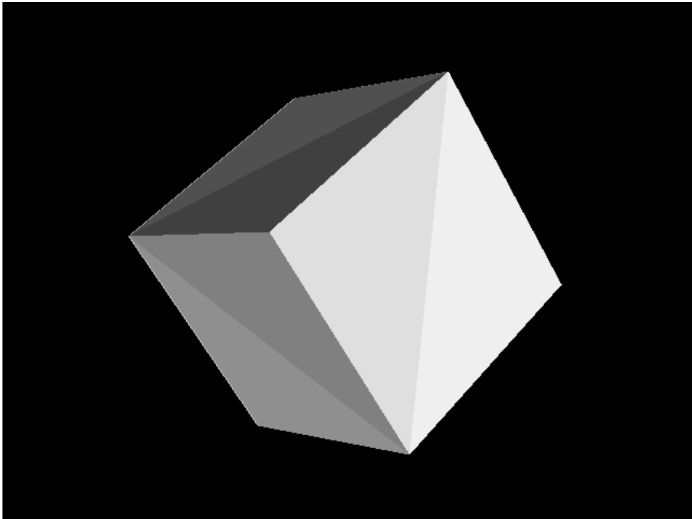

# Day3：实心立方体 — 扫描线填充 + Z-Buffer 深度缓冲

本文档对应目录：`record/day3/`（Day3 快照）。  
在 Day2（线框）基础上，新增 **三角面光栅化（扫描线填充）**、**深度缓冲（Z-Buffer）**、**投影保留 z**。

## 效果预览



> 若图片未显示，请运行 `npm run dev` 截图后保存为同目录下的 `image.png`。

与 Day1 / Day2 对比：

| 项目 | Day1 | Day2 | Day3 |
|------|------|------|------|
| 绘制 | 8 个顶点 | 线框（3 边/三角面） | **三角面内部填充** |
| 深度 | 无 | 无 | **Z-Buffer** |
| `project` 返回 | `Vector2` | `Vector2` | **`Vector3(x,y,z)`** |
| 视觉效果 | 8 个黄点 | 黄色线框 | 灰色实心块、前后遮挡正确 |

`Geometry.ts`、`main.ts` 与 Day2 **相同**（8 顶点 + 12 三角面）；变化集中在 **`Device.ts`**。

---

## 一、整体流程

```
drawingLoop()  【帧循环与 Day1/Day2 相同】
    → clear()          清空颜色缓冲 + 深度缓冲置为很大
    → Rotation += 0.01
    → render()
    → present()

Device.render()  【Day3 核心】
    → MVP（同前）
    → for each Face（12 个）:
          pixelA/B/C = project(顶点)   // 含屏幕 x,y 与 z
          drawTriangle(A,B,C, 面色)  // 扫描线填充 + 每像素深度测试

每个像素：
    processScanLine → 插值 x、z → drawPoint → putPixel
    putPixel：若新 z 更远则丢弃，否则写色并更新 depthbuffer
```

单帧调用链：

```
drawingLoop
├─ clear()
│     backbuffer 清空
│     depthbuffer[i] = 10000000
├─ render()
│     for 12 faces:
│         project → drawTriangle
│              for 每行 y: processScanLine
│                   for 每列 x: 插值 z → putPixel(深度测试)
└─ present()
```

---

## 二、`Geometry.ts` / `main.ts`

与 Day2 完全一致，参见 [day2.md](../day2/day2.md) 第二、三节。  
立方体 12 个三角面索引表不变。

---

## 三、`Device.ts` — Day3 新增与修改

### 3.1 新增成员：`depthbuffer`

```typescript
private depthbuffer: number[];

constructor(...) {
    ...
    this.depthbuffer = new Array(this.workingWidth * this.workingHeight);
}
```

- 长度 = `宽 × 高`，**每个像素一个深度值**（不是 ×4）。
- `clear()` 里全部设为 `10000000`，表示「尚无像素，任何合理 z 都算更近」。

```typescript
for (var i = 0; i < this.depthbuffer.length; i++) {
    this.depthbuffer[i] = 10000000;
}
```

---

### 3.2 `project`：返回带深度的 `Vector3`

```typescript
public project(coord: Vector3, transMat: Matrix): Vector3 {
    const point = Vector3.TransformCoordinates(coord, transMat);
    const x = (point.x * this.workingWidth + this.workingWidth / 2.0) >> 0;
    const y = (-point.y * this.workingHeight + this.workingHeight / 2.0) >> 0;
    return new Vector3(x, y, point.z || 0);
}
```

| 分量 | 含义 |
|------|------|
| `x`, `y` | 屏幕像素坐标 |
| `z` | 透视除法后的深度（Babylon LH 下，**越大通常越远**） |

Day2 只用 x、y 画线；Day3 填充时要 **沿扫描线插值 z**。

---

### 3.3 `putPixel`：深度测试 + 写色

```typescript
public putPixel(x: number, y: number, z: number, color: Color4): void {
    const intX = x >> 0;
    const intY = y >> 0;
    const index = (intX + intY * this.workingWidth) * 4;   // 颜色：RGBA 字节偏移
    const indexz = intX + intY * this.workingWidth;         // 深度：每像素 1 个

    if (this.depthbuffer[indexz] < z) {
        return; // 已存的更近（z 更小），新来的更远 → 不画
    }
    this.depthbuffer[indexz] = z;

    this.backbufferdata[index]     = color.r * 255;
    this.backbufferdata[index + 1] = color.g * 255;
    this.backbufferdata[index + 2] = color.b * 255;
    this.backbufferdata[index + 3] = color.a * 255;
}
```

要点：

1. **先**比较深度，**再**写颜色（顺序不能反）。
2. `index` 与 `indexz` 不可混用：颜色用 `×4`，深度不用。
3. 判断 `depthbuffer[indexz] < z` 时丢弃 → 保留 **更小 z（更近）** 的像素。

若出现前后颠倒，可改为 `if (z < this.depthbuffer[indexz]) return`。

---

### 3.4 工具函数：`clamp` / `interpolate`

```typescript
public clamp(value: number, min = 0, max = 1): number {
    return Math.max(min, Math.min(value, max));
}
public interpolate(min: number, max: number, gradient: number): number {
    return min + (max - min) * this.clamp(gradient);
}
```

扫描线上对 **x、z** 做线性插值时都依赖它们。

---

### 3.5 `processScanLine`：一行扫描线，插值 x 和 z

```typescript
public processScanLine(
    y: number,
    pa: Vector3, pb: Vector3, pc: Vector3, pd: Vector3,
    color: Color4
): void {
    const gradient1 = pa.y !== pb.y ? (y - pa.y) / (pb.y - pa.y) : 1;
    const gradient2 = pc.y !== pd.y ? (y - pc.y) / (pd.y - pc.y) : 1;
    let sx = this.interpolate(pa.x, pb.x, gradient1) >> 0;
    let ex = this.interpolate(pc.x, pd.x, gradient2) >> 0;
    const zStart = this.interpolate(pa.z, pb.z, gradient1);
    const zEnd = this.interpolate(pc.z, pd.z, gradient2);
    if (sx > ex) {
        const t = sx; sx = ex; ex = t;
    }
    for (let x = sx; x < ex; x++) {
        const gradX = ex !== sx ? (x - sx) / (ex - sx) : 0;
        const z = this.interpolate(zStart, zEnd, gradX);
        this.drawPoint(new Vector3(x, y, z), color);
    }
}
```

```
当前扫描线 y 上：
  左边界 x = sx，z = zStart（边 pa→pb）
  右边界 x = ex，z = zEnd（边 pc→pd）
  对每个 x：z 在 zStart 与 zEnd 之间插值 → drawPoint → putPixel
```

`pa,pb,pc,pd` 是三角形两条边的端点（`drawTriangle` 传入），与 Day2 画线用的边一致，但这里要 **填满之间的水平跨度**。

---

### 3.6 `drawTriangle`：扫描线光栅化

```typescript
public drawTrinangle(p1: Vector3, p2: Vector3, p3: Vector3, color: Color4): void {
    // 1. 按 y 排序：p1 最高，p3 最低
    if (p1.y > p2.y) { ... swap ... }
    if (p2.y > p3.y) { ... swap ... }
    if (p1.y > p2.y) { ... swap ... }

    // 2. 从 p1 到 p3 的斜率，分上下两段
    let dP1P2 = ...
    let dP1P3 = ...
    const startY = p1.y >> 0;
    const endY = p3.y >> 0;

    // 3. 每行 y 调用 processScanLine
    if (dP1P2 > dP1P3) {
        for (let y = startY; y <= endY; y++) {
            if (y < p2.y)
                this.processScanLine(y, p1, p3, p1, p2, color);
            else
                this.processScanLine(y, p1, p3, p2, p3, color);
        }
    } else {
        ...
    }
}
```

将三角形在屏幕上扫成很多条水平线，每条线由 `processScanLine` 填像素。

---

### 3.7 `render`：填充三角面（不再画线）

```typescript
const pixelA = this.project(vertexA, transformMatrix);
const pixelB = this.project(vertexB, transformMatrix);
const pixelC = this.project(vertexC, transformMatrix);

const colorValue = 0.25 + ((indexFaces % cMesh.Faces.length) / cMesh.Faces.length) * 0.75;
const faceColor = new Color4(colorValue, colorValue, colorValue, 1);
this.drawTrinangle(pixelA, pixelB, pixelC, faceColor);
```

- Day2 的 `drawBLine` 三行已注释掉。
- 按 `indexFaces` 给不同灰度，便于区分每个三角面（调试向；可改成统一颜色）。

---

## 四、完整 `Device.ts` 代码

```typescript
import { Matrix, Vector3, Vector2 } from "@babylonjs/core/Maths/math.vector.js";
import { Color4 } from "@babylonjs/core/Maths/math.color.js";
import { Camera, Mesh } from './Geometry';

export class Device {
    private workingCanvas: HTMLCanvasElement;
    private workingContext: CanvasRenderingContext2D;
    private workingWidth: number;
    private workingHeight: number;

    private backbuffer!: ImageData;
    private backbufferdata!: Uint8ClampedArray;
    private depthbuffer: number[];

    constructor(canvas: HTMLCanvasElement) {
        this.workingCanvas = canvas;
        this.workingWidth = canvas.width;
        this.workingHeight = canvas.height;
        this.workingContext = this.workingCanvas.getContext("2d")!;
        this.depthbuffer = new Array(this.workingWidth * this.workingHeight);
    }
    public clear(): void {
        this.workingContext.clearRect(0, 0, this.workingWidth, this.workingHeight);
        this.backbuffer = this.workingContext.getImageData(0, 0, this.workingWidth, this.workingHeight);
        this.backbufferdata = this.backbuffer.data;
        for (var i = 0; i < this.depthbuffer.length; i++) {
            this.depthbuffer[i] = 10000000;
        }
    }
    public present(): void {
        this.workingContext.putImageData(this.backbuffer, 0, 0);
    }
    public putPixel(x: number, y: number, z: number, color: Color4): void {
        const intX = x >> 0;
        const intY = y >> 0;
        const index = (intX + intY * this.workingWidth) * 4;
        const indexz = intX + intY * this.workingWidth;

        if (this.depthbuffer[indexz] < z) {
            return;
        }
        this.depthbuffer[indexz] = z;

        this.backbufferdata[index]     = color.r * 255;
        this.backbufferdata[index + 1] = color.g * 255;
        this.backbufferdata[index + 2] = color.b * 255;
        this.backbufferdata[index + 3] = color.a * 255;
    }
    public project(coord: Vector3, transMat: Matrix): Vector3 {
        const point = Vector3.TransformCoordinates(coord, transMat);
        const x = (point.x * this.workingWidth + this.workingWidth / 2.0) >> 0;
        const y = (-point.y * this.workingHeight + this.workingHeight / 2.0) >> 0;
        return new Vector3(x, y, point.z || 0);
    }
    public drawPoint(point: Vector3, color: Color4): void {
        if (point.x >= 0 && point.y >= 0 && point.x < this.workingWidth && point.y < this.workingHeight) {
            this.putPixel(point.x, point.y, point.z, color);
        }
    }
    public clamp(value: number, min: number = 0, max: number = 1): number {
        return Math.max(min, Math.min(value, max));
    }
    public interpolate(min: number, max: number, gradient: number): number {
        return min + (max - min) * this.clamp(gradient);
    }
    public processScanLine(y: number, pa: Vector3, pb: Vector3, pc: Vector3, pd: Vector3, color: Color4): void {
        const gradient1 = pa.y !== pb.y ? (y - pa.y) / (pb.y - pa.y) : 1;
        const gradient2 = pc.y !== pd.y ? (y - pc.y) / (pd.y - pc.y) : 1;
        let sx = this.interpolate(pa.x, pb.x, gradient1) >> 0;
        let ex = this.interpolate(pc.x, pd.x, gradient2) >> 0;
        const zStart = this.interpolate(pa.z, pb.z, gradient1);
        const zEnd = this.interpolate(pc.z, pd.z, gradient2);
        if (sx > ex) {
            const t = sx; sx = ex; ex = t;
        }
        for (let x = sx; x < ex; x++) {
            const gradX = ex !== sx ? (x - sx) / (ex - sx) : 0;
            const z = this.interpolate(zStart, zEnd, gradX);
            this.drawPoint(new Vector3(x, y, z), color);
        }
    }
    public drawTrinangle(p1: Vector3, p2: Vector3, p3: Vector3, color: Color4): void {
        if (p1.y > p2.y) { let temp = p2; p2 = p1; p1 = temp; }
        if (p2.y > p3.y) { let temp = p2; p2 = p3; p3 = temp; }
        if (p1.y > p2.y) { let temp = p2; p2 = p1; p1 = temp; }
        let dP1P2 = p2.y - p1.y > 0 ? (p2.x - p1.x) / (p2.y - p1.y) : 0;
        let dP1P3 = p3.y - p1.y > 0 ? (p3.x - p1.x) / (p3.y - p1.y) : 0;
        const startY = p1.y >> 0;
        const endY = p3.y >> 0;
        if (dP1P2 > dP1P3) {
            for (let y = startY; y <= endY; y++) {
                if (y < p2.y) {
                    this.processScanLine(y, p1, p3, p1, p2, color);
                } else {
                    this.processScanLine(y, p1, p3, p2, p3, color);
                }
            }
        } else {
            for (let y = startY; y <= endY; y++) {
                if (y < p2.y) {
                    this.processScanLine(y, p1, p2, p1, p3, color);
                } else {
                    this.processScanLine(y, p2, p3, p1, p3, color);
                }
            }
        }
    }
    public render(camera: Camera, meshes: Mesh[]): void {
        const ViewMatrix = Matrix.LookAtLH(camera.Position, camera.Target, Vector3.Up());
        const projectionMatrix = Matrix.PerspectiveFovLH(
            0.78,
            this.workingWidth / this.workingHeight,
            0.01,
            100.0
        );
        for (const cMesh of meshes) {
            const worldMatrix = Matrix.RotationYawPitchRoll(
                cMesh.Rotation.y,
                cMesh.Rotation.x,
                cMesh.Rotation.z
            ).multiply(Matrix.Translation(
                cMesh.Position.x,
                cMesh.Position.y,
                cMesh.Position.z
            ));
            const transformMatrix = worldMatrix.multiply(ViewMatrix).multiply(projectionMatrix);
            for (var indexFaces = 0; indexFaces < cMesh.Faces.length; indexFaces++) {
                const currentFace = cMesh.Faces[indexFaces];
                const vertexA = cMesh.Vertices[currentFace.A];
                const vertexB = cMesh.Vertices[currentFace.B];
                const vertexC = cMesh.Vertices[currentFace.C];
                const pixelA = this.project(vertexA, transformMatrix);
                const pixelB = this.project(vertexB, transformMatrix);
                const pixelC = this.project(vertexC, transformMatrix);
                const colorValue = 0.25 + ((indexFaces % cMesh.Faces.length) / cMesh.Faces.length) * 0.75;
                const faceColor = new Color4(colorValue, colorValue, colorValue, 1);
                this.drawTrinangle(pixelA, pixelB, pixelC, faceColor);
            }
        }
    }
}
```

---

## 五、Z-Buffer 数据流（Day3 核心）

```
顶点 (x,y,z 局部)
    → MVP → TransformCoordinates
    → project → 屏幕 (pixelX, pixelY, depthZ)

三角面光栅化：
    对每个像素 (x,y)：
        插值得到 depthZ
        putPixel(x, y, depthZ, color):
            if depthbuffer[x,y] < depthZ → return  （远的不要）
            depthbuffer[x,y] = depthZ
            写 RGBA
```

---

## 六、常见问题

| 现象 | 原因 | 处理 |
|------|------|------|
| 面闪一下 | 曾无 Z-Buffer 或 `depthbuffer[index]` 写错 | 用 `indexz`，先测深度再写色 |
| 前后穿模 | z 比较方向反了 | 试 `if (z < depthbuffer[...]) return` |
| 只有线没有面 | 仍在用 `drawBLine` | 改用 `drawTriangle` |
| 三角形有洞 | `sx >= ex` 未交换 | `if (sx > ex) swap` |
| 深度无效 | `processScanLine` 未插值 z | 使用 `Vector3(x,y,z)` 调 `drawPoint` |

---

## 七、Day1 → Day2 → Day3 路线

```
Day1  顶点 + MVP
Day2  Face + 线框（Bresenham）
Day3  扫描线填充 + Z-Buffer  ← 当前
Day4  背面剔除 / 统一光照 / 纹理（规划）
```

---

## 八、文件清单（`record/day3/`）

| 文件 | 说明 |
|------|------|
| `Geometry.ts` | 同 Day2 |
| `main.ts` | 同 Day2 |
| `Device.ts` | 填充 + 深度缓冲 |
| `day3.md` | 本文档 |
| `image.png` | 运行效果截图（需自行添加） |

---

## 九、阅读顺序

1. 回顾 [Day2 线框](../day2/day2.md)  
2. `putPixel` + `depthbuffer`  
3. `processScanLine` 里 **z 插值**  
4. `drawTriangle` + `render` 画面填充  
5. 对照 `image.png` 看旋转时前后关系是否正确  

---

## 十、推送到 GitHub（可选）

```bash
cp record/day3/*  /path/to/TypeScript-3D-/day3/
git add day3/
git commit -m "Add day3: scanline fill and z-buffer"
git push origin main
```
